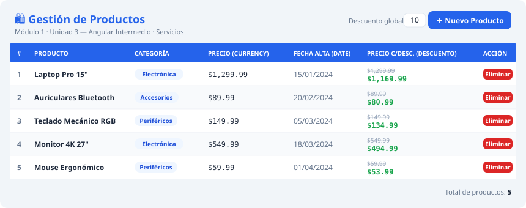
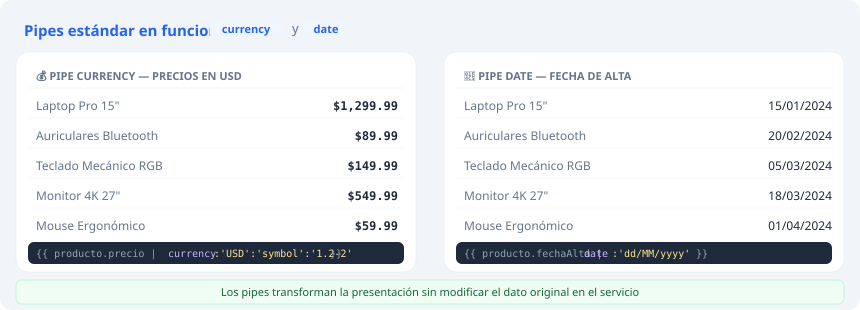
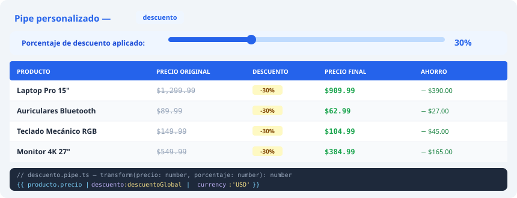
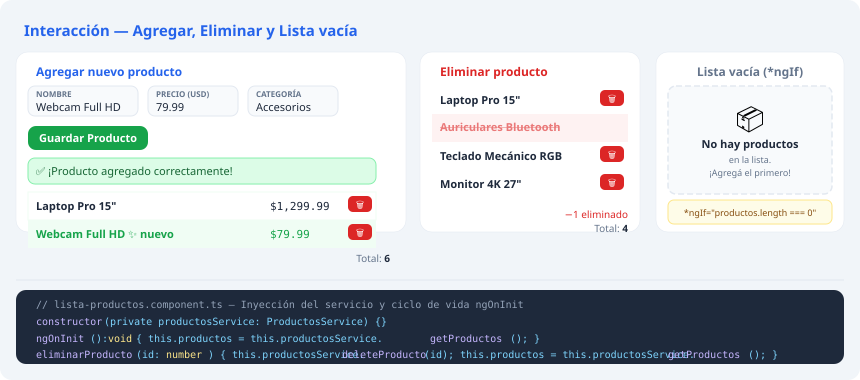

##Productos App — Angular Intermedio

## Descripción del proyecto

Aplicación Angular **v19** que demuestra el uso de **servicios**, **inyección de dependencias**, **pipes estándar** y **pipes personalizados** para gestionar y visualizar una lista de productos.

## El proyecto corresponde al **Módulo 1 - Unidad 3** del curso \_Angular Intermedio

## Funcionalidades

- ✅ Listar productos con datos simulados (array local)
- ✅ Agregar un nuevo producto mediante un formulario
- ✅ Eliminar productos de la lista
- ✅ Mensaje dinámico cuando la lista está vacía (`*ngIf`)
- ✅ Pipe `currency` para mostrar precios en formato USD
- ✅ Pipe `date` para mostrar la fecha de alta (`dd/MM/yyyy`)
- ✅ Pipe personalizado `descuento` con porcentaje ajustable

---

## Estructura del proyecto

```
productos-app/
├── public/                                  # Assets estáticos (Angular 19)
├── screenshots/                             # Capturas de pantalla
├── src/
│   ├── app/
│   │   ├── models/
│   │   │   └── producto.model.ts            # Interfaz Producto
│   │   ├── services/
│   │   │   └── productos.service.ts         # getProductos, addProducto, deleteProducto
│   │   ├── pipes/
│   │   │   └── descuento.pipe.ts            # Pipe personalizado
│   │   ├── components/
│   │   │   └── lista-productos/
│   │   │       ├── lista-productos.component.ts
│   │   │       ├── lista-productos.component.html
│   │   │       └── lista-productos.component.css
│   │   ├── app.component.ts
│   │   └── app.config.ts
│   ├── index.html
│   ├── main.ts
│   └── styles.css
├── angular.json
├── package.json
└── tsconfig.json
```

---

## Detalles técnicos

### Servicio `ProductosService`

Generado con Angular CLI (`ng generate service services/productos`). Contiene:

| Método                  | Descripción                     |
| ----------------------- | ------------------------------- |
| `getProductos()`        | Retorna la lista de productos   |
| `addProducto(producto)` | Agrega un producto nuevo        |
| `deleteProducto(id)`    | Elimina un producto por su `id` |

### Pipe personalizado `DescuentoPipe`

```typescript
// Uso en template:
{{ producto.precio | descuento:20 | currency:'USD' }}
// Aplica un 20% de descuento antes de formatear el precio
```

---

## Requisitos previos

- **Node.js** >= 20.x
- **Angular CLI** >= 19.x

```bash
npm install -g @angular/cli@19
```

---

## Instalación y ejecución

### 1. Clonar el repositorio

```bash
git clone https://github.com/abenitezS/productos-app.git
cd productos-app
```

### 2. Instalar dependencias

```bash
npm install
```

### 3. Ejecutar en modo desarrollo

```bash
ng serve
```

Abrir en el navegador: [http://localhost:4200](http://localhost:4200)

---

## Novedades de Angular 19 utilizadas

| Característica           | Detalle                                           |
| ------------------------ | ------------------------------------------------- |
| Builder `@angular/build` | Reemplaza a `@angular-devkit/build-angular`       |
| Carpeta `public/`        | Reemplaza a `src/assets/` para archivos estáticos |
| Standalone components    | Sin `NgModule`, todo con `standalone: true`       |
| TypeScript 5.6           | Última versión soportada por Angular 19           |

---

## Capturas de pantalla

### 1. Lista de productos cargada



> Se muestran los 5 productos del array simulado con todos los campos: nombre, categoría, precio, fecha de alta y precio con descuento. La lista se carga automáticamente mediante `ngOnInit` al iniciar el componente.

---

### 2. Aplicación de pipes estándar (`currency` y `date`)



> El pipe `currency` formatea los precios en dólares estadounidenses con símbolo y 2 decimales (`$1,299.99`). El pipe `date` transforma los objetos `Date` al formato legible `dd/MM/yyyy`. Ambos pipes se aplican directamente en el template sin modificar el dato en el servicio.

---

### 3. Pipe personalizado `descuento` en funcionamiento



> El pipe `descuento` recibe el precio del producto y un porcentaje como parámetro, y devuelve el precio final con el descuento aplicado. Se encadena con el pipe `currency` para mostrar el resultado formateado: `{{ producto.precio | descuento:descuentoGlobal | currency:'USD' }}`.

---

### 4. Formulario al agregar/eliminar productos y lista vacía



> - **Agregar**: un formulario permite ingresar nombre, precio y categoría. Al guardar, el producto aparece al final de la lista con una confirmación visual.
> - **Eliminar**: cada fila tiene un botón que llama a `deleteProducto(id)` en el servicio y refresca la vista.
> - **Lista vacía**: cuando no hay productos, `*ngIf="productos.length === 0"` activa un mensaje indicativo en lugar de la tabla.

---

## Créditos del autor

- **Estudiante:** Alicia Benitez
- **Curso:** Angular Intermedio
- **Unidad:** Módulo 1 — Unidad 3: Gestión y visualización de datos con pipes

--- 

## Bibliografía y fuentes

- Freeman, A. _Pro Angular 9_. 6ª ed. Apress; 2020.
- Angular. (s.f.). _Understanding dependency injection_. https://angular.dev/guide/di/dependency-injection
- Angular. (s.f.). _Welcome to the Angular tutorial_. https://angular.dev/tutorials/learn-angular
- Angular. (s.f.). _What is Angular?_. https://angular.dev/overview
